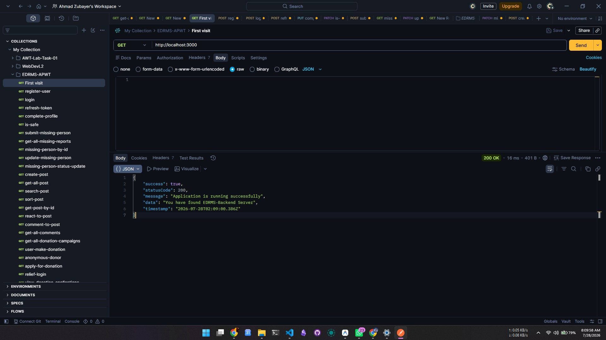
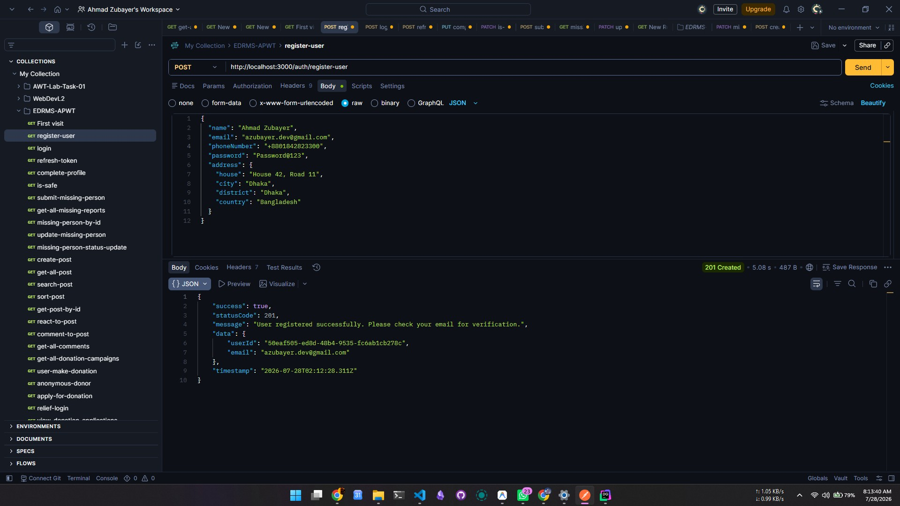
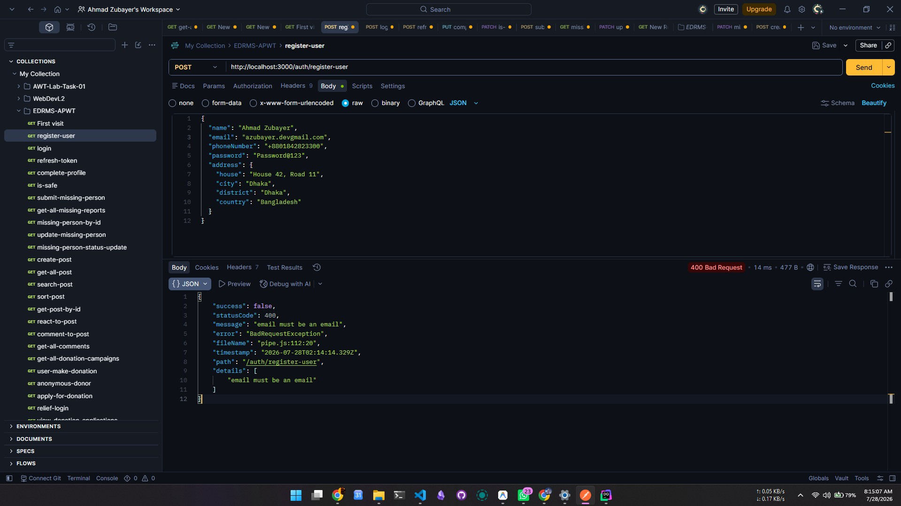
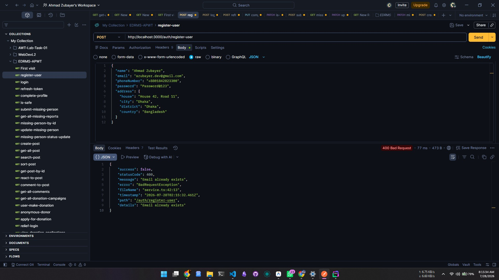
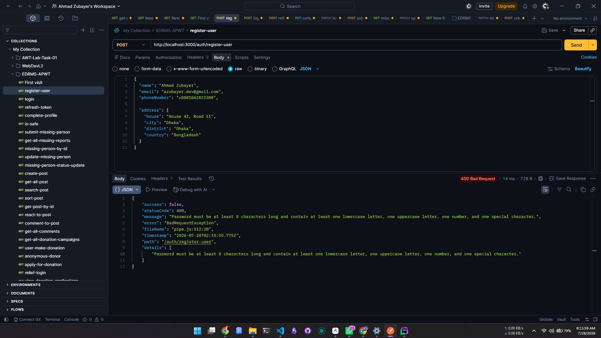
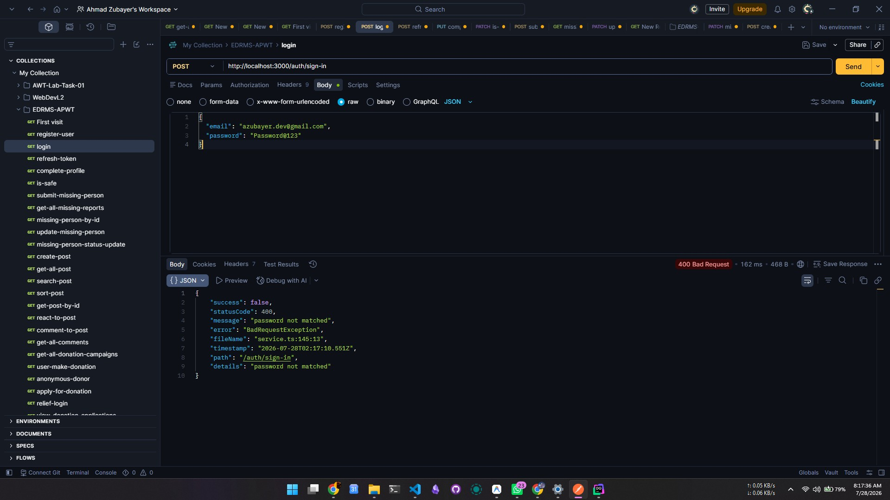
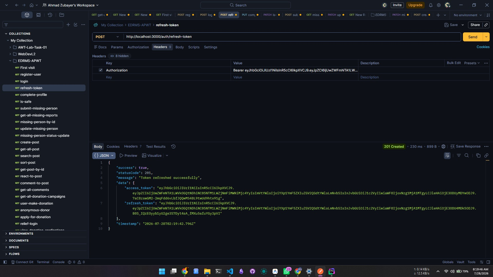

# Emergency Disaster Response & Management System (EDRMS)

**Course**: CSC4161: ADVANCED PROGRAMMING IN WEB TECHNOLOGY [C]  
**Department**: Department of Computer Science, American International University – Bangladesh (AIUB)  
**Supervised By**: Md. Khairul Alam Mazumder  
**Date**: July 28, 2026  

### Group 03 - Team Members:
- **Ahmad Zubayer Mostafa** [23-54734-3]
- **Md Sohag Islam** [23-51072-1]
- **Md. Main Uddin Nayon** [23-51068-1]
- **S. M Nahid Hasan Zisan** [23-50033-1]

**Repository Link**: [https://github.com/AhmadZubayer/Emergency-Disaster-Response-Management-System-APWT](https://github.com/AhmadZubayer/Emergency-Disaster-Response-Management-System-APWT)

---

## Table of Contents
1. [Project Overview & Problem Statement](#project-overview--problem-statement)
2. [System Roles & Role-Based Functionalities](#system-roles--role-based-functionalities)
3. [Tech Stack](#tech-stack)
4. [Setup & Run Instructions](#setup--run-instructions)
5. [Database Schema & ER Diagram](#database-schema--er-diagram)
6. [Functional Features: Complete Endpoint Table (1-91)](#functional-features-complete-endpoint-table)
7. [Postman API Testing Screenshots](#postman-api-testing-screenshots)
8. [Additional Features Added](#additional-features-added)
9. [Git Branching & Workflow](#git-branching--workflow)

---

## Project Overview & Problem Statement

### Problem Statement
During disasters, affected people, volunteers, and relief organizations often lack a centralized platform for effective communication and coordination. This project aims to combine emergency reporting, rescue operations, volunteer management, and relief distribution through an integrated web application.

---

## System Roles & Role-Based Functionalities

### 1. Users
Users register and manage a personal profile, receive official disaster alerts, and save medical and emergency information. They report disasters with location, request rescue or assistance, share live location, and find nearby shelters or volunteers. Users can donate or request donations, submit missing-person reports, confirm safety with "I'm Safe," and track rescue request status.

### 2. Volunteers
Volunteers register and apply for verification, then add rescue skills and set availability. They see nearby matching requests, accept or reject tasks, share live location while on duty, and update task progress. Volunteers also report blocked routes or resource shortages and mark tasks completed.

### 3. Relief Organizations
Relief organizations register and complete verification, publish official disaster alerts, and create/manage donations and volunteer groups. They assign volunteers and resources, manage relief camps and inventory, and monitor camp capacity and facilities. Organizations track operations and generate reports to coordinate relief efforts.

### 4. Admins
Admins manage all accounts and verify or approve public warnings, posts, volunteers, and organizations. They review disaster reports and critical rescue requests, detect duplicates, monitor ongoing operations, and flag suspicious donation activity. Admins also moderate community content and generate disaster response reports.

---

## Tech Stack

- **Framework**: NestJS + TypeScript (Node.js)
- **Database & ORM**: PostgreSQL / MySQL with TypeORM
- **Authentication**: JWT Access & Refresh Token Authentication
- **Documentation**: OpenAPI / Swagger UI (`http://localhost:3000/api/docs`)
- **Payments**: Stripe API Integration
- **Mailing**: Nodemailer (Mailer Module)

---

## Setup & Run Instructions

### Prerequisites
- Node.js (v18 or higher)
- npm / yarn / pnpm
- PostgreSQL or MySQL database running locally or remotely

### 1. Clone the Repository
```bash
git clone https://github.com/AhmadZubayer/Emergency-Disaster-Response-Management-System-APWT.git
cd edrms-backend-v1
```

### 2. Install Dependencies
```bash
npm install
```

### 3. Configure Environment Variables
Create a `.env` file in the root directory:
```env
PORT=3000
DB_TYPE=postgres
DB_HOST=localhost
DB_PORT=5432
DB_USERNAME=postgres
DB_PASSWORD=your_password
DB_NAME=edrms_db

JWT_SECRET=your_jwt_secret_key
JWT_EXPIRES_IN=15m
JWT_REFRESH_SECRET=your_jwt_refresh_secret
JWT_REFRESH_EXPIRES_IN=7d

STRIPE_SECRET_KEY=sk_test_...
```

### 4. Run Development Server
```bash
npm run start:dev
```

### 5. Access Interactive Swagger API Docs
```
http://localhost:3000/api/docs
```

---

## Database Schema & ER Diagram

### Database Entity-Relationship (ER) Diagram


### Schema Summary
The database includes relational schemas for `auth`, `users`, `volunteers`, `relief_org`, `disasters`, `shelters`, `rescue_requests`, `missing_persons`, `campaigns`, `donations`, `aid_applications`, `community_posts`, `comments`, `reactions`, `field_reports`, `organization_requests`, and `group_joins`.

---

## Functional Features: Complete Endpoint Table

Base URL: `http://localhost:3000`

| No. | Endpoint | HTTP Req Type | Authorization | Description |
| :--- | :--- | :--- | :--- | :--- |
| 1 | `/` | GET | Public | Confirms that the application backend server is running successfully. |
| 2 | `/auth/register-user` | POST | Public | Registers a new user account and sends an email verification link. |
| 3 | `/auth/verify-email` | GET | Public | Verifies a user's email address using a token provided in the link. |
| 4 | `/auth/sign-in` | POST | Public | Authenticates user credentials and returns JWT access and refresh tokens. |
| 5 | `/auth/refresh-token` | POST | Authenticated (Refresh Token) | Generates a new access token using a valid refresh token. |
| 6 | `/users/update-profile` | PATCH | Authenticated (Any User) | Updates user profile information and optional avatar photo. |
| 7 | `/users/complete-profile` | PUT | Authenticated (Any User) | Completes initial profile setup with mandatory contact and location data. |
| 8 | `/users/is-safe` | PATCH | Authenticated (Any User) | Toggles the safety status of the user during a disaster event. |
| 9 | `/admin/volunteer-verification-requests` | GET | admin | Fetches all pending volunteer verification requests for admin review. |
| 10 | `/admin/relief-org-verification-requests` | GET | admin | Fetches all pending relief organization verification requests. |
| 11 | `/admin/change-role/volunteer/:userId` | PATCH | admin | Promotes a user to volunteer role and verifies volunteer status. |
| 12 | `/admin/change-role/relief-org/:userId` | PATCH | admin | Promotes a user to relief organization role and marks as verified. |
| 13 | `/admin/change-role/admin/:userId` | PATCH | admin | Grants administrative permissions to the designated user account. |
| 14 | `/admin/tables` | GET | admin | Lists all database tables along with their total record counts. |
| 15 | `/admin/tables/:tableName` | GET | admin | Retrieves raw data records from a specified database table. |
| 16 | `/admin/users` | GET | admin | Retrieves a complete list of all registered users in the system. |
| 17 | `/admin/volunteers` | GET | admin | Retrieves a complete list of registered volunteers in the system. |
| 18 | `/admin/relief-orgs` | GET | admin | Retrieves a complete list of registered relief organizations. |
| 19 | `/admin/disasters` | GET | admin | Retrieves a complete list of recorded disaster alerts. |
| 20 | `/admin/shelters` | GET | admin | Retrieves a complete list of emergency shelters in the database. |
| 21 | `/admin/rescue-requests` | GET | admin | Retrieves a complete list of all emergency rescue requests. |
| 22 | `/admin/missing-persons` | GET | admin | Retrieves a complete list of reported missing person cases. |
| 23 | `/admin/campaigns` | GET | admin | Retrieves a complete list of all donation campaigns. |
| 24 | `/admin/community-posts` | GET | admin | Retrieves a complete list of community posts and announcements. |
| 25 | `/community-posts` | GET | Public | Retrieves community posts with optional search, sorting, and user filtering. |
| 26 | `/community-posts/:id` | GET | Public | Fetches detailed information for a specific community post. |
| 27 | `/community-posts/:id/comments` | GET | Public | Fetches all user comments posted under a specific community post. |
| 28 | `/community-posts` | POST | Authenticated (Any User) | Creates a new community post with optional file attachments. |
| 29 | `/community-posts/:id` | PATCH | Authenticated (Author / Admin) | Updates existing post details or attached media files. |
| 30 | `/community-posts/:id/status` | PATCH | Authenticated (Author / Admin) | Updates the operational visibility status of a community post. |
| 31 | `/community-posts/:id/bump` | PATCH | Authenticated (Any User) | Bumps a post to move it to the top of the community feed. |
| 32 | `/community-posts/:id` | DELETE | Authenticated (Author / Admin) | Deletes a community post from the platform. |
| 33 | `/community-posts/:id/react` | POST | Authenticated (Any User) | Records or toggles a user reaction on a community post. |
| 34 | `/community-posts/:id/comments` | POST | Authenticated (Any User) | Adds a new comment to a specific community post. |
| 35 | `/community-posts/:id/comments/:commentId` | DELETE | Authenticated (Commenter / Admin) | Deletes a specific comment from a community post. |
| 36 | `/community-posts/:id/report` | POST | Authenticated (Any User) | Submits a moderation report against a community post. |
| 37 | `/disaster` | POST | relief_org | Broadcasts a new emergency disaster alert and sends notifications. |
| 38 | `/donations/campaigns` | GET | Public | Retrieves all active financial aid and donation campaigns. |
| 39 | `/donations/campaigns/:id` | GET | Public | Retrieves details of a specific donation campaign. |
| 40 | `/donations/campaigns/:id/donate` | POST | Public | Initiates a checkout payment session for a donation campaign. |
| 41 | `/donations/payment/success` | GET | Public | Verifies successful payment gateway callbacks and logs donation. |
| 42 | `/donations/payment/cancel` | GET | Public | Handles cancelled payment gateway transactions. |
| 43 | `/donations/campaigns/:id/apply` | POST | Authenticated (Any User) | Submits an application to request financial aid from a campaign. |
| 44 | `/donations/my-applications` | GET | Authenticated (Any User) | Retrieves financial aid applications submitted by the logged-in user. |
| 45 | `/donations/applications` | GET | relief_org, admin | Retrieves all submitted financial aid applications for organization review. |
| 46 | `/donations/applications/:id/review` | PATCH | relief_org, admin | Approves or rejects a submitted financial aid application. |
| 47 | `/missing-persons` | POST | Authenticated (Any User) | Creates a missing person report with photos and description. |
| 48 | `/missing-persons/my` | GET | Authenticated (Any User) | Retrieves missing person reports filed by the logged-in user. |
| 49 | `/missing-persons` | GET | Public | Retrieves all missing person reports with status and search filters. |
| 50 | `/missing-persons/:id` | GET | Public | Retrieves full details for a specific missing person report. |
| 51 | `/missing-persons/:id` | PATCH | Authenticated (Reporter / Admin) | Updates missing person details and uploaded photos. |
| 52 | `/missing-persons/:id/status` | PATCH | Authenticated (Reporter / Admin) | Updates tracking status of a missing person report. |
| 53 | `/missing-persons/:id` | DELETE | Authenticated (Reporter / Admin) | Deletes a missing person report entry. |
| 54 | `/relief-org/sign-up-as-relief-org` | POST | Authenticated (Any User) | Submits relief organization application with official documentation. |
| 55 | `/relief-org/:id/verify` | PATCH | admin | Verifies a relief organization and upgrades user account role. |
| 56 | `/relief-org/profile/me` | GET | Authenticated (Any User) | Retrieves relief organization profile of the logged-in user. |
| 57 | `/relief-org` | GET | Public | Retrieves a list of all registered relief organizations. |
| 58 | `/relief-org/:id` | GET | Public | Retrieves detailed information for a specific relief organization. |
| 59 | `/rescue-requests` | POST | Authenticated (Any User) | Submits an urgent rescue request with location and media upload. |
| 60 | `/rescue-requests/my` | GET | Authenticated (Any User) | Retrieves rescue requests created by the logged-in user. |
| 61 | `/rescue-requests` | GET | Authenticated (Any User) | Retrieves all active emergency rescue requests in the system. |
| 62 | `/rescue-requests/:id` | GET | Authenticated (Any User) | Retrieves detailed information for a specific rescue request. |
| 63 | `/rescue-requests/:id/status` | PATCH | Authenticated (Any User) | Updates the operational status of an active rescue request. |
| 64 | `/rescue-requests/:id/cancel` | PATCH | Authenticated (Any User) | Cancels an emergency rescue request filed by the user. |
| 65 | `/shelter` | POST | relief_org, admin | Creates a new disaster shelter entry with location and capacity. |
| 66 | `/shelter` | GET | Public | Retrieves available disaster shelters with optional disaster filter. |
| 67 | `/shelter/:id` | GET | Public | Retrieves detailed information and current capacity of a shelter. |
| 68 | `/shelter/:id` | PATCH | relief_org, admin | Updates shelter information, capacity, and amenities. |
| 69 | `/shelter/:id` | DELETE | relief_org, admin | Deletes a shelter record from the system. |
| 70 | `/volunteers/register` | POST | Authenticated (Any User) | Registers current user as a volunteer with skills and location data. |
| 71 | `/volunteers/me` | GET | Authenticated (Any User) | Retrieves volunteer profile details of the logged-in user. |
| 72 | `/volunteers/me` | PATCH | Authenticated (Any User) | Updates volunteer profile details, availability, and skills. |
| 73 | `/volunteers/verification/apply` | POST | Authenticated (Any User) | Submits documentation for official volunteer verification. |
| 74 | `/volunteers/:id/verification` | PATCH | admin | Reviews and approves or rejects a volunteer's verification request. |
| 75 | `/volunteers/duty/location` | PATCH | Authenticated (Any User) | Updates live duty location coordinates of an active volunteer. |
| 76 | `/volunteers/rescue-requests/nearby` | GET | Authenticated (Any User) | Retrieves nearby rescue requests within a given radius. |
| 77 | `/volunteers/rescue-tasks/:requestId/accept` | POST | Authenticated (Any User) | Accepts an assigned rescue task dispatch. |
| 78 | `/volunteers/rescue-tasks/:requestId/reject` | POST | Authenticated (Any User) | Declines an assigned rescue task dispatch. |
| 79 | `/volunteers/rescue-tasks/my` | GET | Authenticated (Any User) | Retrieves all rescue tasks currently assigned to the volunteer. |
| 80 | `/volunteers/rescue-tasks/:taskId/progress` | PATCH | Authenticated (Any User) | Updates progress status and notes for an active rescue task. |
| 81 | `/volunteers/rescue-tasks/:taskId/complete` | PATCH | Authenticated (Any User) | Marks an assigned rescue task as completed. |
| 82 | `/volunteers/field-reports/routes` | POST | Authenticated (Any User) | Submits a field report regarding road damage or blockage. |
| 83 | `/volunteers/field-reports/shortages` | POST | Authenticated (Any User) | Submits a field report regarding local supply shortages. |
| 84 | `/volunteers/field-reports/my` | GET | Authenticated (Any User) | Retrieves field reports submitted by the logged-in volunteer. |
| 85 | `/volunteers/organization-requests` | POST | relief_org, admin | Creates a volunteer callout request from a relief organization. |
| 86 | `/volunteers/organization-requests` | GET | Authenticated (Any User) | Retrieves open volunteer callout requests posted by organizations. |
| 87 | `/volunteers/organization-requests/:id/join` | POST | Authenticated (Any User) | Expresses volunteer interest to join an organization callout. |
| 88 | `/volunteers/organization-requests/my/joins` | GET | Authenticated (Any User) | Retrieves organization callout requests joined by the volunteer. |
| 89 | `/volunteers/rescue-groups/:id/join` | POST | Authenticated (Any User) | Joins a volunteer rescue team assigned to a specific request. |
| 90 | `/volunteers/missing-person-groups/:id/join` | POST | Authenticated (Any User) | Joins a volunteer search team assigned to locate a missing person. |
| 91 | `/volunteers/group-joins/my` | GET | Authenticated (Any User) | Retrieves all rescue and search teams joined by the volunteer. |

---

## Postman API Testing Screenshots

The `/screenshots` directory contains visual verification of API test executions:

### 1. Application Health Check


### 2. User Registration & Validation





### 3. Authentication & JWT Tokens





### 4. User Profile & Safety Status


### 5. Missing Persons Module Testing


---

## Additional Features Added

- Email notification using Mailer
- Refresh Token authentication
- Custom decorators
- Global and custom exception handling
- Searching, sorting
- File upload (e.g., profile image or documents)
- API documentation using Swagger
- Logging using the NestJS Logger
- Audit logs (Created By, Updated By, Deleted By)
- Environment-based configuration using .env
- Stripe Integration

---

## Git Branching & Workflow

### Development Branches
- `dev-zubayer`
- `dev-shohag`
- `dev-nayon`
- `dev-zisan`

> **Note:** Commit code to your dedicated feature branch (`dev-<name>`). Direct commits to `main` or `dev` are strictly prohibited.

### Daily Development Commands

```bash
# Switch to your branch
git switch dev-zubayer

# Pull latest changes
git pull origin dev-zubayer

# Stage and commit work
git add .
git commit -m "feat: implemented volunteer task dispatching module"

# Push to remote branch
git push origin dev-zubayer
```

### Merging into `dev`
```bash
# Switch to main dev branch
git switch dev
git pull origin dev

# Merge feature branch after team review
git merge dev-zubayer
git push origin dev
```